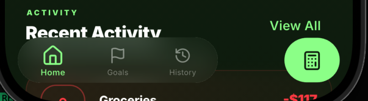
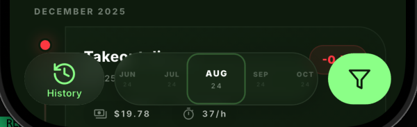

[](https://pub.dev/packages/ios_fluid_interactions)

# iOS Fluid Interactions

A Flutter package providing iOS-style fluid, spring-based animations and touch interactions with beautiful bottom navigation bar components.

## Demo

▶️ **Watch the demo video on [Twitter](https://twitter.com/ketanchoyal/status/2012653863015252214)**

See the fluid animations and elastic interactions in action.

## Screenshots

<div align="center">

<table>
  <tr>
    <td width="33%" align="center">
      
    </td>
    <td width="33%" align="center">
      
    </td>
  </tr>
</table>

</div>

---

## Features

### FluidBottomNavBar

A beautiful iOS-style bottom navigation bar with fluid animations and elastic interactions:

- **Elastic drag interactions**: Spring-based physics with jelly effect during drag
- **Cursor glow tracking**: Optional radial glow that follows pointer position
- **Shrink-to-select**: Tap current tab to shrink nav bar and reveal floating widget
- **Adaptive scaling**: Auto-calculates scale based on widget size
- **Custom destinations**: Define navigation items with `FluidNavDestination`
- **Trailing action button**: Optional action button with slide animations
- **Theme support**: Full theming via `FluidBottomNavBarTheme`
- **Custom item builder**: Use your own widget builder for nav items
- **Highlight tracking**: Visual highlight follows drag across items

### ElasticTapGesture

A widget that applies elastic spring animations on tap with iOS-style "bouncy" interactions:

- **Gesture detection**: Handles tap, long tap, drag
- **Elastic animation**: Spring physics with 5 animation controllers
- **Cursor glow**: Optional radial glow via `showCursorGlow`
- **Adaptive scaling**: Auto-calculates scale based on widget size
- **Volume preservation**: Jelly effect during drag
- **Extension types**: Type-safe presets for physics parameters

### Glow

Easy-to-use radial glow effect widget that auto-tracks pointer position:

- **Auto-tracking**: Wraps any widget, no manual position tracking needed
- **Simple API**: Just `Glow(enabled: true, child: MyWidget())`
- **Customizable**: Radius, color, and blend mode

### Elastic Types

Type-safe extension types for configuring physics parameters:

- **ElasticDampingIntencity**: Controls bounce behavior (low/medium/high)
- **DragIntensity**: Controls movement during drag (none/low/medium/high)
- **DeformIntensity**: Controls jelly effect (low/medium/high)
- **Scaling**: Controls scale on tap (none/slight/adaptive)

---

## Installation

Add this to your package's `pubspec.yaml`:

```yaml
dependencies:
  ios_fluid_interactions:
```

---

## Usage

### FluidBottomNavBar - Complete navigation solution

```dart
// Define your destinations
final destinations = [
  FluidNavDestination(
    icon: Icons.home_outlined,
    filledIcon: Icons.home,
    label: 'Home',
  ),
  FluidNavDestination(
    icon: Icons.flag_outlined,
    label: 'Goals',
  ),
  FluidNavDestination(
    icon: Icons.history_outlined,
    label: 'History',
  ),
];

// Use the navigation bar
ValueNotifier<bool> shrinkNotifier = ValueNotifier<bool>(false);

FluidBottomNavBar(
  currentIndex: currentIndex,
  onTap: (index) => setState(() => currentIndex = index),
  shrinkNotifier: shrinkNotifier,
  destinations: destinations,
  // Optional: Show floating widget when nav bar shrinks
  floatingWidget: MyFloatingWidget(),
  floatingWidgetTabIndex: 0, // Only show on first tab
  // Optional: Add trailing action button
  trailingButtonConfig: FluidTrailingActionButtonConfig(
    icon: Icons.add,
    onTap: (index) => print('Add tapped on tab $index'),
  ),
  // Optional: Custom theme
  theme: FluidBottomNavBarTheme(
    backgroundColor: Colors.white,
    activeColor: Colors.green,
    inactiveColor: Colors.grey,
    borderRadius: 30,
  ),
  // Optional: Elastic physics configuration
  scaling: Scaling.adaptive,
  elasticDampingIntensity: ElasticDampingIntencity.medium,
  deformIntensity: DeformIntensity.medium,
  dragIntensity: DragIntensity.medium,
  enableGlow: true, // Enable cursor glow
)

// Somewhere in your build method - trigger shrink on current tab tap
// (This is handled automatically by FluidBottomNavBar)
```

**Shrink-to-select behavior:**

- Tap any non-current tab → Navigate to that tab
- Tap the current tab → Shrink nav bar and show `floatingWidget` (if configured)
- Tap again → Expand nav bar

### FluidTrailingActionButton - Standalone action button

```dart
FluidTrailingActionButton(
  currentIndex: currentIndex,
  config: FluidTrailingActionButtonConfig(
    icon: Icons.add,
    onTap: (index) => print('Tapped on tab $index'),
    backgroundColor: Colors.green,
    iconColor: Colors.white,
    showCursorGlow: true,
  ),
)

// Or with dynamic icon per tab
FluidTrailingActionButton(
  currentIndex: currentIndex,
  config: FluidTrailingActionButtonConfig(
    iconBuilder: (index) {
      switch (index) {
        case 0: return Icons.add;
        case 1: return Icons.edit;
        case 2: return Icons.delete;
        default: return Icons.more_horiz;
      }
    },
    onTap: (index) => print('Action on tab $index'),
  ),
)

// Or with fully custom builder
FluidTrailingActionButton(
  currentIndex: currentIndex,
  config: FluidTrailingActionButtonConfig(
    builder: (context, index, onTap, child) {
      return FloatingActionButton(
        onPressed: onTap,
        child: Icon(Icons.add),
      );
    },
    onTap: (index) => print('Tapped'),
  ),
)
```

### FluidBottomNavBarTheme - Custom styling

```dart
FluidBottomNavBarTheme(
  backgroundColor: Colors.white,
  activeColor: Color(0xFF4CAF50), // Green
  inactiveColor: Color(0xFF9E9E9E), // Grey
  labelColor: Color(0xFF9E9E9E),
  activeLabelColor: Color(0xFF4CAF50),
  borderColor: Colors.white,
  shadowColor: Colors.white,
  borderRadius: 30,
  shadowBlurRadius: 20,
  shadowSpreadRadius: 1,
  shrinkAnimationDuration: Duration(milliseconds: 300),
  opacityAnimationDuration: Duration(milliseconds: 200),
).resolve() // Call resolve() to get resolved theme
```

### ElasticTapGesture - Complete solution

```dart
// Basic usage
ElasticTapGesture(
  onTap: () => print('Tapped!'),
  child: MyWidget(),
)

// With cursor glow (iOS-style touch feedback)
ElasticTapGesture(
  onTap: () => print('Tapped!'),
  showCursorGlow: true,
  child: MyWidget(),
)

// With long tap and custom physics using extension types
ElasticTapGesture(
  onTap: () => print('Tapped!'),
  onLongTap: () => print('Long pressed!'),
  scaling: Scaling.adaptive,
  elasticDampingIntencity: ElasticDampingIntencity.high,
  deformIntensity: DeformIntensity.high,
  dragIntensity: DragIntensity.low,
  showCursorGlow: true,
  child: MyWidget(),
)

// Using fixed scale instead of adaptive
ElasticTapGesture(
  onTap: () => print('Tapped!'),
  scaling: Scaling.slight, // Fixed 1.05 scale
  showCursorGlow: true,
  child: MyWidget(),
)
```

### Glow - Standalone glow

```dart
// Easy to use - just wrap your widget
Glow(
  enabled: true,
  child: Container(
    width: 100,
    height: 100,
    color: Colors.blue,
  ),
)

// Custom styling
Glow(
  enabled: true,
  radius: 300.0,  // Larger glow
  color: Colors.blue,  // Blue glow
  blendMode: BlendMode.color,  // Solid color
  child: MyWidget(),
)
```

### Extension Types Reference

```dart
// ElasticDampingIntencity - Controls bounce behavior
ElasticDampingIntencity.low     // 5.0 - More bounce, more oscillation
ElasticDampingIntencity.medium  // 10.0 - Balanced bounce
ElasticDampingIntencity.high    // 20.0 - Less bounce, settles quickly
ElasticDampingIntencity(15.0)   // Custom value

// DragIntensity - Controls movement during drag
DragIntensity.none    // 0.0 - Widget stays in place
DragIntensity.low     // 0.5 - Widget follows finger less
DragIntensity.medium  // 1.0 - Normal movement
DragIntensity.high    // 2.0 - Widget follows finger more

// DeformIntensity - Controls jelly effect
DeformIntensity.low     // 0.5 - Subtle jelly effect
DeformIntensity.medium  // 1.0 - Balanced jelly effect
DeformIntensity.high    // 2.0 - Dramatic jelly effect

// Scaling - Controls scale on tap
Scaling.none          // 1.0 - No scaling
Scaling.slight         // 1.05 - Small scale
Scaling.adaptive       // Auto-calculate based on widget size
Scaling(1.2)          // Custom scale value
```

---

## Parameters

### FluidBottomNavBar

| Parameter                 | Default                          | Description                              |
| ------------------------- | -------------------------------- | ---------------------------------------- |
| `currentIndex`            | required                         | Currently selected tab index             |
| `onTap`                   | required                         | Called when a destination is tapped      |
| `shrinkNotifier`          | required                         | Controls nav bar shrink state            |
| `destinations`            | required                         | List of navigation destinations          |
| `theme`                   | `null`                           | Optional theme configuration             |
| `floatingWidget`          | `null`                           | Widget to show when nav bar shrinks      |
| `floatingWidgetTabIndex`  | `null`                           | Only show floating widget on this tab    |
| `trailingButtonConfig`    | `null`                           | Configuration for trailing action button |
| `trailingWidget`          | `null`                           | Custom trailing widget                   |
| `enableGlow`              | `true`                           | Enable cursor glow effect                |
| `itemBuilder`             | `null`                           | Custom builder for nav items             |
| `scaling`                 | `Scaling.adaptive`               | Scale behavior                           |
| `elasticDampingIntensity` | `ElasticDampingIntencity.medium` | Damping for elastic animation            |
| `deformIntensity`         | `DeformIntensity.medium`         | Deformation during drag                  |
| `dragIntensity`           | `DragIntensity.medium`           | Drag movement intensity                  |
| `scaleGrowthPixels`       | `10.0`                           | Pixel growth for adaptive scaling        |

### FluidTrailingActionButton

| Parameter      | Default  | Description              |
| -------------- | -------- | ------------------------ |
| `currentIndex` | required | Current navigation index |
| `config`       | required | Button configuration     |

### FluidTrailingActionButtonConfig

| Parameter            | Default             | Description                |
| -------------------- | ------------------- | -------------------------- |
| `icon`               | `null`              | Single icon for all tabs   |
| `iconBuilder`        | `null`              | Dynamic icon per tab       |
| `builder`            | `null`              | Fully custom button widget |
| `onTap`              | required            | Tap callback with index    |
| `backgroundColor`    | `Color(0x1A4CAF50)` | Button background color    |
| `iconColor`          | `Color(0xFF4CAF50)` | Icon color                 |
| `borderColor`        | `Colors.white`      | Border color               |
| `borderColorAlpha`   | `0.1`               | Border transparency (0-1)  |
| `shadowColor`        | `Colors.white`      | Shadow color               |
| `shadowBlurRadius`   | `20`                | Shadow blur radius         |
| `shadowSpreadRadius` | `1`                 | Shadow spread radius       |
| `width`              | `64`                | Button width               |
| `height`             | `52`                | Button height              |
| `iconSize`           | `24`                | Icon size                  |
| `showCursorGlow`     | `true`              | Enable cursor glow         |
| `borderRadius`       | `40`                | Border radius              |

### FluidNavDestination

| Parameter    | Default  | Description             |
| ------------ | -------- | ----------------------- |
| `icon`       | required | Icon for inactive state |
| `label`      | required | Label text              |
| `filledIcon` | `null`   | Icon for active state   |
| `key`        | `null`   | Optional key            |

### ElasticTapGesture

| Parameter                 | Default                          | Description                               |
| ------------------------- | -------------------------------- | ----------------------------------------- |
| `child`                   | required                         | Widget to display and animate             |
| `onTap`                   | `null`                           | Called when tap is released inside widget |
| `onLongTap`               | `null`                           | Called when tap is held for 500ms         |
| `onTapDown`               | `null`                           | Called when pointer goes down             |
| `onTapUp`                 | `null`                           | Called when pointer goes up               |
| `onPointerMove`           | `null`                           | Called when pointer moves                 |
| `enabled`                 | `true`                           | Whether elastic behavior is enabled       |
| `showCursorGlow`          | `false`                          | Show radial glow effect under cursor      |
| `scaling`                 | `Scaling.adaptive`               | Scale behavior (see extension types)      |
| `scaleGrowthPixels`       | `10.0`                           | Pixel growth for adaptive scaling         |
| `elasticDampingIntencity` | `ElasticDampingIntencity.medium` | Damping for elastic animation             |
| `deformIntensity`         | `DeformIntensity.medium`         | Deformation responsiveness during drag    |
| `dragIntensity`           | `DragIntensity.medium`           | Drag movement intensity                   |

### Glow

| Parameter   | Default             | Description                    |
| ----------- | ------------------- | ------------------------------ |
| `child`     | required            | Widget to display              |
| `enabled`   | `true`              | Whether glow effect is enabled |
| `color`     | `Colors.white`      | Color of glow                  |
| `radius`    | `250.0`             | Radius of glow effect          |
| `blendMode` | `BlendMode.overlay` | Blend mode for glow            |

---

## How It Works

### ElasticTapGesture Animation

The widget uses 5 independent animation controllers for smooth, natural motion:

1. **Scale** - Overall size (1.0 = normal size)
2. **DeformX** - Horizontal stretch (1.0 = normal, >1 = stretched, <1 = compressed)
3. **DeformY** - Vertical stretch (1.0 = normal)
4. **ShiftX** - Horizontal offset in pixels (0.0 = no offset)
5. **ShiftY** - Vertical offset in pixels (0.0 = no offset)

All controllers are unbounded (can exceed 0-1 range) to allow spring overshoot for natural bounce effects.

### Volume Preservation (Jelly Effect)

When dragging, the widget maintains visual "volume preservation":

- Moving horizontally → stretches X, compresses Y
- Moving vertically → stretches Y, compresses X
- Moving diagonally → balanced (no deformation)

This creates the characteristic "jelly" or "rubber" feel.

### Spring Physics

The widget uses three different spring configurations:

1. **Press spring** - Quick, snappy (mass: 1.2, stiffness: 500, damping: 15)
2. **Release spring** - Smooth, controlled (mass: 1.0, stiffness: 180, damping: 24)
3. **Elastic spring** - Bouncy, user-configurable damping (mass: 1.0, stiffness: 250, damping: customizable)

### Adaptive Scaling

When `Scaling.adaptive`, the widget calculates scale to produce consistent pixel growth across different widget sizes:

Formula: `scale = 1.0 + (scaleGrowthPixels / diagonal)`

Examples with `scaleGrowthPixels = 10`:

- 50x50 widget → scale ≈ 1.14
- 100x100 widget → scale ≈ 1.07
- 200x200 widget → scale ≈ 1.04

### FluidBottomNavBar Interactions

1. **Tap navigation**: Tap any destination to navigate
2. **Shrink-to-select**: Tap the current tab to shrink the nav bar
3. **Floating widget reveal**: Shrink reveals the `floatingWidget` (if configured)
4. **Drag highlighting**: Drag across items with visual highlight following
5. **Haptic feedback**: Medium impact on tap, selection click on highlight change

---

## Architecture

```
FluidBottomNavBar (navigation bar)
  ├── ElasticTapGesture (container drag)
  ├── Glow (optional cursor glow)
  ├── FluidNavItem (individual items)
  └── FluidTrailingActionButton (optional action button)

ElasticTapGesture (gesture detection)
  ├── Spring animations (5 controllers)
  │     ├── Scale animation
  │     ├── DeformX/Y animation (jelly effect)
  │     └── ShiftX/Y animation (drag movement)
  └── Optional Glow (radial highlight)
        └── CustomPaint
```

---

## License

MIT License - see LICENSE file for details
